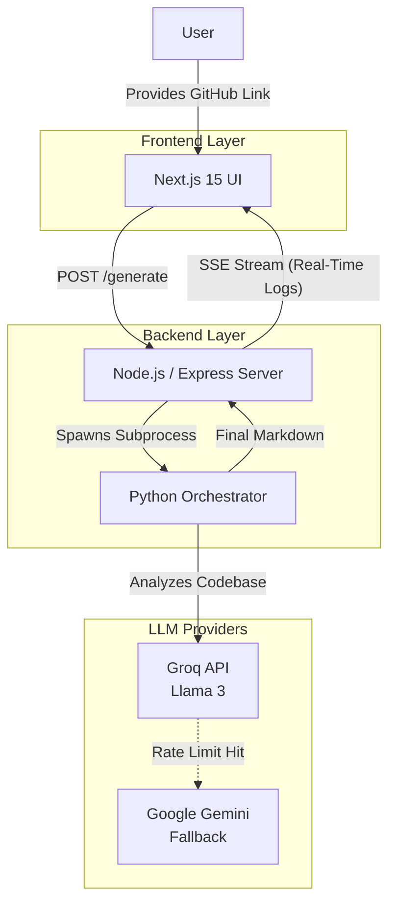

<div align="center">
  

  **Because your code deserves a better README.**

  [](https://readme-generator-six-puce.vercel.app)
  [](https://readme-generator-mpo3.onrender.com/health)
  [](https://nextjs.org/)
  [](https://python.org)
</div>

---

##  The Problem & The Solution

**The Problem:** Developers hate writing documentation. Great projects die because no one knows how to use them, but writing a good README manually takes hours of agonizing over structure and formatting.

**The Solution:** Drop a GitHub link. Get a professional, technically accurate, and comprehensive README generated in seconds. No friction. 100% Magic.

<br>

<details>
<summary><b> Click here to see Core Features</b></summary>
<br>

-  **Multi-Agent AI Pipeline**: Doesn't just dump code into an LLM. It intelligently filters noise, selects architecturally significant files, chunks them, and synthesizes them.
-  **Real-Time Streaming UX**: Uses Server-Sent Events (SSE) to stream live terminal logs from the Python engine to the Next.js frontend. No boring loading spinners.
-  **Bulletproof LLM Fallback**: Built-in fallback manager gracefully handles rate limits by rotating through multiple Groq API keys and falling back to Google Gemini, guaranteeing 99% uptime.
-  **"Godmode" Aesthetic**: Stunning UI built with Tailwind CSS, Framer Motion, and Aceternity components.

</details>

---

## 🛠️ Architecture Overview

The system is built as a hybrid monorepo, decoupling the high-performance frontend from the heavy lifting of the AI backend.



---

##  Getting Started (Local Setup)

To run this project locally, ensure you have **Node.js 18+**, **Python 3.10+**, and **Git** installed on your machine.

### 1. Clone & Install
```bash
git clone https://github.com/pranshulgupta33940/README-GENERATOR.git
cd README-GENERATOR

# Installs Node modules (frontend + backend) and Python dependencies
npm run install:all
```

### 2. Configure Environment
Set up your API keys in the Python engine.
```bash
# Rename the example file
cp backend/python/.env.example backend/python/.env
```
Edit `backend/python/.env` and add your **Groq API Keys** or **Gemini API Key**.

### 3. Run the App
```bash
# Starts both frontend (port 3000) and backend (port 5001) concurrently
npm run dev
```

Visit `http://localhost:3000` to start generating!

---

## 📂 Project Structure

<details>
<summary><b>View Directory Map</b></summary>

```text
README-GENERATOR/
├── frontend/                 # Next.js 15 Web App
│   ├── app/                  # App router pages
│   ├── components/           # React components (Tailwind, Motion)
│   └── lib/                  # Utilities & API configuration
├── backend/                  # Express API Server
│   ├── src/
│   │   ├── routes/           # Express endpoints (SSE setup)
│   │   └── utils/            # Repo cloning tools (simple-git)
│   └── python/               # LangGraph / LangChain Engine
│       ├── agents_groq.py    # Multi-agent orchestrator
│       ├── llm_fallback.py   # Resilient rate-limit handler
│       └── prompts.py        # System instructions
└── package.json              # Monorepo scripts
```
</details>

---

##  What We Learned Building This

1. **AI Engineering is 80% Error Handling:** Making an API call is easy. Building a system that survives rate limits, context window overflows, and network blips is incredibly hard. Our `llm_fallback.py` was born from this necessity.
2. **UX Bridges the Latency Gap:** Generating a README for a massive codebase takes 30-60 seconds. By streaming real-time terminal logs via SSE, we turned a "slow loading time" into an engaging, hacker-like experience.
3. **Deployment Quirks:** Bridging the gap between Vercel (Frontend), Render (Backend), CORS policies, and Linux vs. Windows Python virtual environments requires intense platform-specific engineering.

---
<div align="center">
  <i>Built to make open-source a little less chaotic.</i>
</div>
